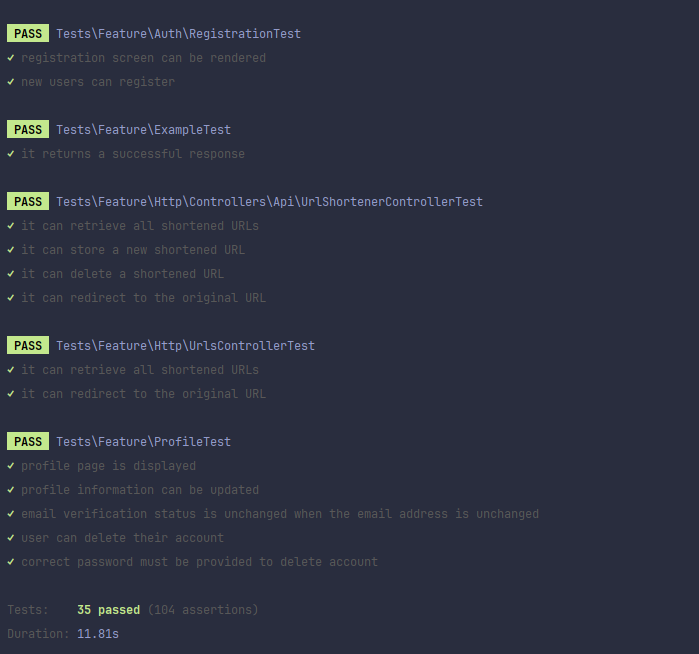

# 🛠️ Technical Challenge Spot2 (IC FullStack)

### Description
At Spot2, a pioneering prop-tech in the commercial real estate sector, we recognize that constant innovation is the cornerstone of our success. This commitment to technological advancement demands not only designing systems that scale efficiently and meet the highest standards of code quality, but also implementing solutions that reflect our excellence in execution and solid programming practices. We are looking for individuals passionate about technology who share our dedication to these principles, so that together we can continue to lead innovation in the commercial real estate market.

You can find the complete document at the following URL - [Challenge Document](docs/doc.pdf)

## 🚀 **Technical Challenge Solution Summary**

The technical challenge was successfully tackled by leveraging Laravel, Vue.js, and Inertia.js, adhering to TDD principles using Pest. Here's a brief summary of the solution:

- **Model and Unit Tests**
    - Models and their respective unit tests were created.
    - The `ShortenedUrl` model was designed to handle URL shortening, ensuring the uniqueness of original URLs.

- **API Controller**
    - An API controller for managing URLs was implemented.
    - It includes methods for fetching, creating, and deleting URLs, returning JSON responses with appropriate status codes.
    - Swagger was used to decorate the API controller and generate documentation.

- **Vue Component Setup**
    - A Vue component named `Urls.vue` was created to display stored URLs in a table format.
    - It communicates with the backend API to fetch and delete URLs, utilizing axios for HTTP requests.

- **Inertia Integration**
    - Although not fully implemented, the solution is poised for Inertia.js integration to enhance frontend interactivity and improve user experience.
    - Some frontend functionalities are yet to be implemented for a complete user experience.

Overall, the solution demonstrates effective usage of Laravel, Vue.js, and Inertia.js, coupled with TDD practices, to develop a URL shortener application with scalability and maintainability in mind. Further enhancements, particularly regarding the frontend with Inertia.js, remain to be implemented to elevate the user interface and experience.

## 🧪 Unit Tests

### Testing

Actually, the app is currently hosted at the following URL: [https://urls.trabajocontinuo.com/urls](https://urls.trabajocontinuo.com/urls). You can test the application by visiting this link. Additionally, you can find the documentation at [https://urls.trabajocontinuo.com/docs](https://urls.trabajocontinuo.com/docs).
